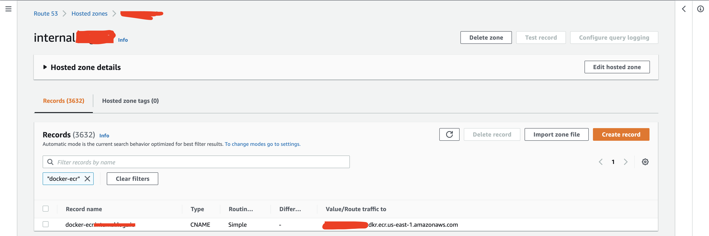

# Pulling out Docker images through AWS Route53 CNAME of AWS ECS service

The main idea of this project is to use CNAME of Route53 to pull or/and push images from/to AWS ECR service.
By default, Amazon doesn't allow to do it (SSL handshake is not working. SSL has been signed by Amazon side).

The issue looks like:
```shell
$ CNAME_URL="docker-ecr.internal.vnatarov.io" &&\
aws ecr get-login-password --region us-east-1 --profile default | docker login --username AWS --password-stdin $CNAME_URL
Error response from daemon: Get "https://docker-ecr.internal.vnatarov.io/v2/": x509: certificate is valid for *.dkr.ecr.us-east-1.amazonaws.com, *.dkr.ecr.us-east-1.vpce.amazonaws.com, not docker-ecr.internal.vnatarov.io
```

I played around with Amazon API and Python and proxy - I have found several solutions:
- Use Python and develop wrapper to login, pull & push AWS ECR images from/to ECR through AWS Route53 CNAME of AWS ECS service
- Use Some proxy (Ex: Nginx, Traefik, etc) and make forwarding rules with needed headers. This implementation is `TBD` soon!
- Amazon ECR interface VPC endpoints (AWS PrivateLink)


## AWS Route53

Create CNAME record to your AWS ECR registry. You can use example with Terraform. The CNAME record looks like:



## Simple checks

```shell
CNAME_URL="https://docker-ecr.internal.vnatarov.io" &&\
AWS_ACCOUNT_ID="XXXXXXXXXXXXXXX" &&\
AWS_ECR_REPO_NAME="repo-name" &&\
TOKEN=$(aws ecr get-authorization-token --region us-east-1 --profile default --output text --query 'authorizationData[].authorizationToken') && curl -k -i -H "Host: $AWS_ACCOUNT_ID.dkr.ecr.us-east-1.amazonaws.com" -H "Authorization: Basic $TOKEN" -H "X-Forwarded-Proto: https" -H "X-Forwarded-For 127.0.0.1" -H "X-Real-IP: 93.72.109.140" $CNAME_URL/v2/$AWS_ECR_REPO_NAME/tags/list
```
The output:
```shell
HTTP/1.1 200 OK
Docker-Distribution-Api-Version: registry/2.0
Link: <https://XXXXXXXXXXXXXXX.dkr.ecr.us-east-1.amazonaws.com/v2/repo-name/tags/list?last=ukD72mdD%2FmC8b5xV3susmJzzaTgp3hKwR9nRUW1yZZ7uIM42T5Qni9DYGx4CJpnhNeJ6HnjEzAukCdhHEgsIYR6ZPbIPWoMte%2Bkmss2BWER%2BOoldEmVa6n9tG88nfx8J3qz2X7nNmzKTvj9S75hqjlupun8iXyGm2Cef6EHKr6JqI7jXVAS0aBWToKUCsATn1R2LRKTxsdsk7HLTSmjieo3kdVioZ6%2F0%2BsiGagwFc6QZfrwH1%2Bl%2F%2Ba1ritf4IwZUXVC4kuID%2BzHKxz9rtgMBgDDBA1yjW8hZqO3K2tOa77h3i%2BPVqj6aHA096YMRh5BFiiLWPGgss0L4QQahaooOLRRg7kdr5k%2FZIqllcmGaLbioNLy3R5jOon7X61YbIGF7fUOkssj72o37fpPd%2FJG2g%3D%3D>; rel="next"
Date: Wed, 17 Nov 2021 11:06:47 GMT
Content-Type: text/plain; charset=utf-8
Transfer-Encoding: chunked

{"name":"accounts","tags":["943bf60acceb327ee85717d2b52cfd97374f4340","ade31de1df53b7c96575f6f27bec17c9f7702cb8"]}
```
So, you can see that if you add some headers, Amazon can allow you to use AWS ECR service.
Based on this point, I developed `ecr-containers.py` Python script. This script allow you to `pull` images from AWS ECR.
I planned to add `push` method as well soon.

## Install
- Install python
- Install pip and after it, all packages from `requirements.txt` file.
- Download the `ecr-containers.py` to your laptop and set `chmod +x ecr-containers.py` on it.

## Usage

Simple run looks like the next one:
```shell
$ python3 ecr-containers.py --profile=default
config_filename:  2a5d611b6675bbcb15fea6050fdf5af2d974494511967e1ccd816efbe95fa348.json
manifest:  [{'Config': '2a5d611b6675bbcb15fea6050fdf5af2d974494511967e1ccd816efbe95fa348.json', 'RepoTags': [], 'Layers': ['339de151aab4bc06eed8409daae147c408478cb538dacb90cc63f19ad4eba80b/layer.tar', 'c79c496f1543a6cf36a79305de7c709ea55c16b63ea86219c4b98c334b70488d/layer.tar', 'a5382bad4f98c8f742d943e2bd6930626b06af081c57062e06a501d449a4c472/layer.tar', '348e701aca2b0acab9fab3daaa10980e5507b8e55334671f503d1d5f5ef739a5/layer.tar', '965b2a30aa9c5ffea05d772b418c428cde9fa3f85faf37b2b66b719593f4c7b6/layer.tar', '9ee6edf857abe493670c386faa46127a9decea128da3fcafe25015afa8f6b9ef/layer.tar', '75f33f1b8076396b9a688c579ffb6ee4e7d7c83e94a9ba4d15b97a7efb118db7/layer.tar', 'a79e84406bd9b1f9c48e60589691a9ef807c7416cf1b2885eafc95fbbd3bbd8c/layer.tar', 'e5279c73940e27e2d0e32d8c288c32a795eeb12d4bf876e27067a7a49d032d6c/layer.tar', 'b088ed07f0856dbc5d7451536d3379a8c0dee79ddf98f7bdcef98e37549669fa/layer.tar', '09c3905aed6a2dd924c4a3fed0802d3cc191cdfc317c960ea9c43c9f8a4379c5/layer.tar', '7486d5d0bd29e293ed034751b9743c3f30405aa4746f353151ed44e2d827fc76/layer.tar']}]
--- 3.93 seconds ---
```
*NOTE:* You can use additional args and to get help, use:
```shell
$ python3 ecr-containers.py -h
usage: python3 script_name.py {ARGS}

optional arguments:
  -h, --help            show this help message and exit
  --version             show program's version number and exit
  --bclient BOTO3_CLIENT
                        Set boto3 client
  --region REGION       Set AWS region for boto3
  --pname PROFILE_NAME, --profile PROFILE_NAME
                        Set profile name of AWS
  --rname ROLE_NAME, --role-name ROLE_NAME
                        Set role ARN name
  --rsession ROLE_SESSION, --role-session ROLE_SESSION
                        Set role session name
  --registry-url REGISTRY_URL, --url REGISTRY_URL
                        Set Registry URL
  --ecr-url ECR_URL     Set URL from ECR registry
  --ecr-repo ECR_REPO, -repo ECR_REPO
                        Set ECR repo name
  --ecr-repo-tag ECR_REPO_TAG, -repo-tag ECR_REPO_TAG
                        Set ECR repo tag
  --ec2 AWS_EC2         Set ec2 usage

created by Vitalii Natarov
```

After, we must load the downloaded image:
```shell
$ docker load < 8f2b55cc45894247d880f7c4ac2042ed7c398dfa
32f366d666a5: Loading layer [==================================================>]  2.801MB/2.801MB
45449966e51a: Loading layer [==================================================>]  192.3MB/192.3MB
83ef90c94f12: Loading layer [==================================================>]   2.92MB/2.92MB
54037642f52c: Loading layer [==================================================>]    200kB/200kB
b9e5e90eb033: Loading layer [==================================================>]  42.09MB/42.09MB
539aca899eb8: Loading layer [==================================================>]     206B/206B
9d00a6a26f53: Loading layer [==================================================>]  4.668kB/4.668kB
bca0da0f1ea4: Loading layer [==================================================>]  1.631kB/1.631kB
cbb7b9b8cd31: Loading layer [==================================================>]  197.9MB/197.9MB
a0f1352db34e: Loading layer [==================================================>]  8.519kB/8.519kB
2543c13d39a0: Loading layer [==================================================>]  1.833kB/1.833kB
eb9876ca8f14: Loading layer [==================================================>]   41.2MB/41.2MB
Loaded image ID: sha256:ada32a4765be57eb1049808ebdbc7b8b6108847375383a21ffe004f3fffc3757
```

## Terrafrom usage
In the `examples` folder located the Terraform files to create AWS Route53 CNAME to AWS ECR registry. Also, the EC2 modules to create simple EC2 machine to test how the CNAME will be worked.


## Authors
Created and maintained by [Vitaliy Natarov](https://github.com/SebastianUA). An email: [vitaliy.natarov@yahoo.com](vitaliy.natarov@yahoo.com).

## License
Apache 2 Licensed. See [LICENSE](https://www.apache.org/licenses/LICENSE-2.0) for full details.


## Additional links:
- [AmazonECR registry auth - official page](https://docs.aws.amazon.com/AmazonECR/latest/userguide/registry_auth.html)
- [Docker Image Specification](https://github.com/moby/moby/blob/master/image/spec/v1.2.md)
- [Docker pull by Python](https://github.com/sdenel/docker-pull-push/blob/master/docker-pull)
- [Docker push by Python](https://github.com/sdenel/docker-pull-push/blob/master/docker-push)
- [test ecr boto3 project](https://github.com/spulec/moto/blob/master/tests/test_ecr/test_ecr_boto3.py)
- [Amazon ECR interface VPC endpoints (AWS PrivateLink)](https://docs.aws.amazon.com/AmazonECR/latest/userguide/vpc-endpoints.html)
- [Boto3 credentials](https://boto3.amazonaws.com/v1/documentation/api/latest/guide/credentials.html)
